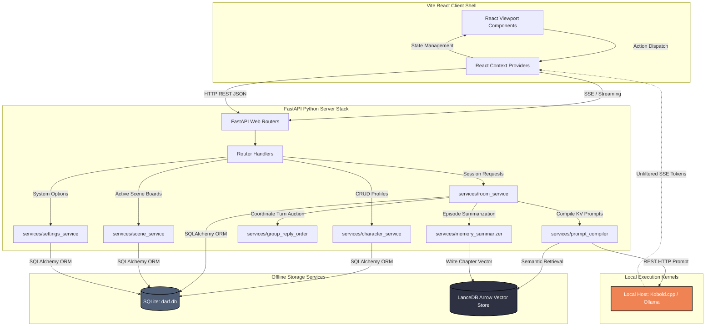

# 🧱 System Architecture & Database Blueprints

Darf UI relies on a highly modular, decoupled client-server architecture. The backend service acts as a serverless engine coordinating relational transactions, serverless high-dimensional vector lookups, local LLM API streaming, and real-time canvas coordinate syncing.

---

## 🗺️ Unified System Data Flow

The diagram below maps how the frontend React views communicate with the FastAPI services, local databases, and offline model execution kernels:

---

## 💾 Relational Database Schema (SQLite: darf.db)

All relational models and session histories map to a localized SQLite server running in **WAL (Write-Ahead Logging)** mode. The schema contains nine ORM models defined inside [database.py](../app/core/database.py):

### 1. `Settings`
Global coordinates tracking LLM connectivity parameters and the default user persona.
* `id` (*Integer, Primary Key*): Fixed single row (ID = 1).
* `provider` (*String, default="ollama"*): The LLM target provider (`"ollama" | "kobold" | "openrouter"`).
* `openrouter_key` (*String, Nullable*): API cloud authorization token.
* `local_endpoint` (*String, default="http://127.0.0.1:11434/v1"*): Local LLM base connection URL.
* `selected_model` (*String, Nullable*): The explicit model identifier tags.
* `temperature` (*Float, default=0.9*): Generation creativity bounds.
* `max_tokens` (*Integer, default=2048*): Maximum generated response length.
* `system_template` (*Text*): The core system prompt frame outlining roleplay behavior rules.
* `cloud_rate_limit` (*Integer, default=15*): Requests ceiling limit when query cloud providers.
* `persona_name` (*String, default="User"*): The default display name of the player.
* `persona_avatar` (*Text, Nullable*): Base64-encoded image string representing the player's profile avatar.
* `persona_description` (*Text, Nullable*): Custom backstory and physical traits of the player's persona.
* `persona_character_id` (*Integer, Nullable*): Soft foreign key to play as an existing character card.

### 2. `Character`
AI roleplay sheet profile cards importing Tavern formats and standard definitions.
* `id` (*Integer, Primary Key, Index*): Unique serial identifier.
* `world_id` (*Integer, ForeignKey("worlds.id", ondelete="SET NULL"), Nullable, Index*): Links the card to a specific lore universe.
* `name` (*String, Not Null*): The character's name.
* `avatar` (*Text, Nullable*): Relative file path, external URL, or Base64 string.
* `greeting` (*Text, Nullable*): The opening dialog turn triggered on room entry.
* `personality` (*Text, Nullable*): Internal attributes, physical descriptions, and W++ styles.
* `scenario` (*Text, Nullable*): Scenario prompt framing defining active situations.
* `example_dialogue` (*Text, Nullable*): Example dialogues outlining speech and action styles.
* `created_at` (*DateTime, Server Default=func.now()*): Creation timestamp.

### 3. `ChatSession`
Dynamic sandbox chat rooms containing single characters or active multi-bot roster members.
* `id` (*String, Primary Key, Index*): Consolidated UUID string.
* `name` (*String, Not Null*): The display name of the room.
* `is_group` (*Boolean, default=False*): Discriminator tag indicating multi-bot group scenes.
* `description` (*Text, Nullable*): Dynamic environment outline and special rules.
* `scene_state` (*Text, default="{}"*): SQLite-serialized JSON string tracking coordinates, room locations, active moods, and motivations.
* `created_at` (*DateTime, Server Default=func.now()*): Room initialization timestamp.

### 4. `RoomMember`
Unified junction mapping binding characters into active rooms.
* `id` (*Integer, Primary Key, Index*): Mapping serial.
* `room_id` (*String, ForeignKey("chat_sessions.id", ondelete="CASCADE"), Index*).
* `character_id` (*Integer, ForeignKey("characters.id", ondelete="CASCADE"), Index*).
* **Constraints**: Imposes a `UniqueConstraint("room_id", "character_id", name="uq_room_members_room_character")` to prevent duplicate character mappings inside the same room.

### 5. `Message`
Chronological dialog entries written by the player or character entities inside rooms.
* `id` (*Integer, Primary Key, Index*): Serial primary key.
* `room_id` (*String, ForeignKey("chat_sessions.id", ondelete="CASCADE"), Index*): Links the dialog line to the chat room.
* `sender_type` (*String, Not Null*): Entity tags (`"user" | "character"`).
* `character_id` (*Integer, ForeignKey("characters.id", ondelete="CASCADE"), Nullable, Index*): ID mapping linking back to character profiles.
* `sender_name` (*String, Not Null*): Cached string of the sender name.
* `content` (*Text, Not Null*): The active display text.
* `swipes` (*Text, default="[]" in column "swipes"*): SQLite-serialized JSON list of alternative swipe responses.
* `active_swipe_index` (*Integer, default=0*): Pointer coordinate identifying the active swipe.
* `created_at` (*DateTime, Server Default=func.now()*): Dialog timestamp.
* **Indexes**: Imposes a compound `Index("ix_messages_room_id_id", "room_id", "id")` to allow extremely fast chronological history loads inside rooms.

### 6. `World`
Consolidated organizational containers grouping characters and lore codex systems together.
* `id` (*Integer, Primary Key, Index*).
* `name` (*String, Not Null, Unique*): Unique identifier string naming the world setting.
* `description` (*Text, Nullable*).
* `created_at` (*DateTime, Server Default=func.now()*).

### 7. `LoreEntry`
Semantic codex components loaded contextually via raw keyword intersections and vector scores.
* `id` (*Integer, Primary Key, Index*).
* `world_id` (*Integer, ForeignKey("worlds.id", ondelete="CASCADE"), Nullable, Index*).
* `title` (*String, Not Null*): Header descriptor.
* `keys` (*Text, Not Null*): Comma-separated search keys (e.g. `magic, spells, arcane`).
* `content` (*Text, Not Null*): Codex text block injected into prompts on match triggers.
* `is_active` (*Boolean, default=True, Index*): Master active switch toggles.
* `weight` (*Integer, default=100*): Execution priority weights.
* `created_at` (*DateTime, Server Default=func.now()*).
* **Indexes**: Imposes a compound `Index("ix_lore_entries_world_id_active", "world_id", "is_active")` to ensure swift lookups of active world entries.

### 8. `ChatSummary`
Asynchronously compiled milestone summaries generated by background workers.
* `id` (*Integer, Primary Key, Index*).
* `room_id` (*String, ForeignKey("chat_sessions.id", ondelete="CASCADE"), Not Null, Index*).
* `summary_text` (*Text, Not Null*): Narrative digest outlining physical milestones in under 100 words.
* `start_message_id` (*Integer, Not Null*): Start boundary of summarized messages.
* `end_message_id` (*Integer, Not Null*): End boundary of summarized messages.
* `created_at` (*DateTime, Server Default=func.now()*).

### 9. `UISticker`
Absolute coordinates tracking customizable decal layers active on the application canvas.
* `id` (*String, Primary Key, Index*): Unique sticker asset UUID.
* `image_data` (*Text, Not Null*): Base64-encoded transparent PNG file.
* `x` (*Float, default=100.0*) / `y` (*Float, default=100.0*): Canvas viewport coordinates.
* `scale` (*Float, default=1.0*): Scale transform boundaries ($0.2\times - 4.0\times$).
* `rotation` (*Integer, default=0*): Rotation matrix boundaries ($0^\circ - 360^\circ$).
* `opacity` (*Float, default=0.8*): Transparency ranges ($0.1 - 1.0$).
* `target_selectors` (*Text, Nullable*): Comma-separated CSS element target queries (e.g. `.chat-sidebar, .avatar-frame`) to enable automatic snaps.
* `created_at` (*DateTime, Server Default=func.now()*).

---

## 🗄️ LanceDB Arrow Vector Schema

Darf UI employs a CPU-based, serverless **LanceDB** vector store to manage high-dimensional similarity arrays without database server overhead. Leveraging Apache Arrow under the hood, LanceDB achieves zero-copy scans and high-density retrievals.

The table schemas are defined below:

| Column Field | Apache Arrow Type | Core Description |
| :--- | :--- | :--- |
| **`id`** | `UTF8` | Unique node identifier (e.g. `mem_12`, `lore_4_chunk_1`). |
| **`type`** | `UTF8` | Discriminator tags partition (`"memory" \| "lore"`). |
| **`source_id`** | `UTF8` | Isolation query tags matching either Room UUID or World Lore ID. |
| **`title`** | `UTF8` | Header label mapping summaries or codex titles. |
| **`text`** | `UTF8` | The raw narrative text block analyzed by the local embedding engine. |
| **`vector`** | `Float32[512]` | 512-dimension coordinate arrays generated by local CPU SentenceTransformers. |

> [!TIP]
> **Semantic Isolation Layer**: To prevent private memory leaks between separate chat sessions, LanceDB queries execute SQL-style pre-filtering checks: `type = 'memory' AND source_id = '{room_id}'`. This guarantees vector semantic lookups remain strictly isolated within the active room context boundary.
