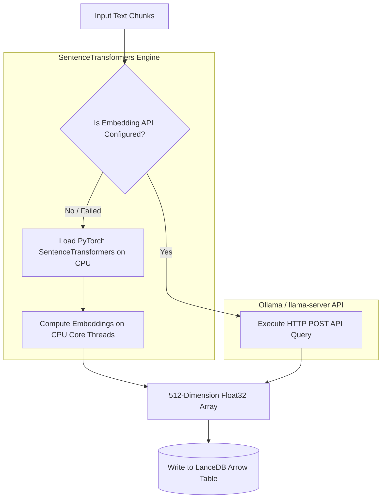
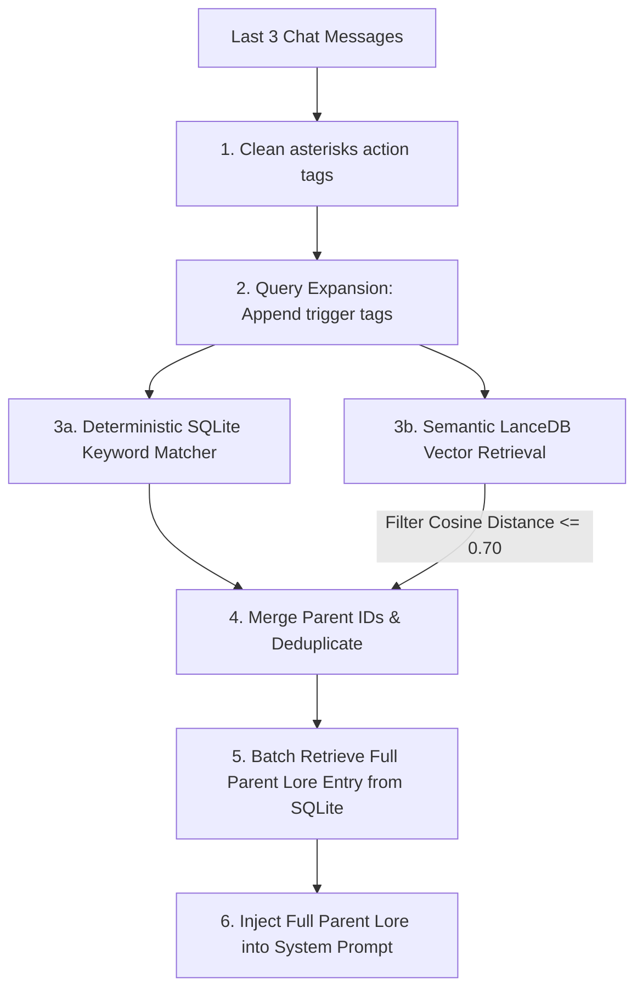

# 🧠 Chronicle Memory & Semantic RAG Engine

Darf UI solves the problem of local context limits and hardware VRAM exhaustion by combining an asynchronous, milestone-aware **Chronicle Memory Book** with a serverless, CPU-bound **LanceDB vector search database** utilizing **Jina v2 Small** embeddings.

---

## 📜 Chronicle Memory Book

Instead of feeding thousands of historical chat logs directly into the LLM context (which balloons prompt evaluation latency), Darf UI runs an asynchronous background summarization service located in [memory_summarizer.py](../app/services/memory_summarizer.py).

### The Distillation Pipeline:
1. **Turn Counters**: The system monitors the quantity of unsummarized dialogue turns in each active room.
2. **15-Turn Milestone Check**: When exactly **15 unsummarized turns** occur, a background worker thread is spawned.
3. **Dialogue Compiling**: The compiler fetches the 15 unsummarized turns and formats them into a clean, raw dialogue script.
4. **Clinical Summary Generation**: The backend triggers the active LLM with a highly optimized, objective prompt framing rules. The LLM compresses the script into a **dense, third-person narrative chapter under 100 words** detailing key events, physical movements, active moods, and milestone transformations.
5. **Database Syncing**: The chapter summary is saved as a `ChatSummary` record in SQLite and simultaneously indexed in the LanceDB RAG database.

---

## 🗄️ LanceDB Vector RAG Store

All high-density vector indices and similarity queries are coordinated inside [rag_store.py](../app/services/rag/rag_store.py).

### Jina v2 Small Embedding Model (512 Dimensions)
The system employs the state-of-the-art `jina-embeddings-v2-small-en` model. This model offers high-fidelity contextual vectors on an extremely tiny footprint (only **65 MB** in memory!), running completely on the CPU to protect the GPU's VRAM for local model generations.



---

## 🔍 Hybrid RAG Context Retrieval

When compiling the context, the system queries the active world lore entries in [prompt_compiler.py](../app/services/prompt_compiler.py) via a high-performance **Hybrid Search Engine**:



### Calibration Cutoffs
To prevent "hallucinated context" or irrelevant noise, cosine distance filters are calibrated:
* **Distance $\le 0.47$**: Extremely tight semantic match (high relevance).
* **Distance $0.48 - 0.69$**: Generic topical match.
* **Distance $\ge 0.70$**: Excluded as noise.

---

## ⚡ KV Prefix Caching Optimization

For standard 6GB VRAM setups, processing system prompts with large history matrices causes huge generation delays (Time-to-First-Token lag). Darf UI solves this by enforcing strict **Prefix Caching Layouts** inside [prompt_compiler.py](../app/services/prompt_compiler.py).

Prefix caching allows LLM engines (like Kobold.cpp or Ollama) to lock compiled key-value pairs in memory as long as the prompt prefix remains identical.

### Prompt Assembly Layout
Darf UI divides prompts into three blocks:

```
┌──────────────────────────────────────────────────────────┐
│ 1. STATIC PREFIX (100% Cacheable)                        │
│    - System Template rules                               │
│    - Selected Character Profile                          │
│    - Global Room Setting scenarios                       │
│    - Roster of other Room Members                        │
│    - User Persona description                            │
├──────────────────────────────────────────────────────────┤
│ 2. SEMI-STATIC MIDDLE (Intermittent Cache Hits)          │
│    - Retreived Lore Entries (updates when topics change) │
│    - Retrieved Episodic Memories (updates on summaries)  │
├──────────────────────────────────────────────────────────┤
│ 3. DYNAMIC SUFFIX (Invalidates Cache at Bottom)          │
│    - SQLite Active Room Scene Board (location, actions)  │
│    - Immediate Private Motivations                       │
│    - Final instruction directives                        │
└──────────────────────────────────────────────────────────┘
```

> [!IMPORTANT]
> By placing dynamic variables (like the Scene board status and character motivations) at the **absolute bottom** of the system prompt and maintaining static details at the top, Kobold.cpp's `SmartContext` can retain up to **90% of the KV cache** across consecutive turns. This reduces prompt evaluation speeds from 5-10 seconds down to **less than 150 milliseconds**!
