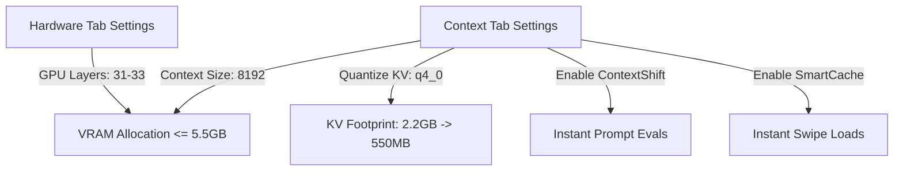

# ⚡ 6GB VRAM Laptop Tuning Guide

Running state-of-the-art 8B parameter models (such as *Llama-3-8B-Instruct, Mistral-7B, or Fimbulvetr-11B*) completely locally can easily overwhelm standard gaming laptops with **6GB of VRAM and 16GB of system RAM**. If VRAM is exceeded by even a few megabytes, Windows automatically offloads model layers to slow system RAM, causing response speeds to plummet from 25 tokens/sec to less than 1 token/sec.

This guide provides the exact settings required in **Kobold.cpp** to run massive contexts smoothly on a 6GB VRAM card without crashes.

---

## 🚀 Why Kobold.cpp over Ollama?

While Ollama is incredibly user-friendly, **Kobold.cpp** offers several highly optimized local memory features that make it the superior choice for VRAM-constrained systems:

1. **Smart KV Cache Quantization**: Slashing the VRAM footprint of chat history.
2. **ContextShift**: Sliding context window that prevents costly prompt re-evaluations.
3. **SmartCache**: Caching multi-swipe alternatives in background VRAM slots.

---

## 🔧 Recommended Kobold.cpp Configuration

Open the Kobold.cpp GUI launcher, expand the **Show Advanced** panel, and configure the tabs exactly as shown below:



### 🔷 1. Hardware Tab
* **Preset / Backend**: Select `Use CUDA` (this activates hardware acceleration on NVIDIA GPUs).
* **GPU Layers (Preserve VRAM headroom)**: Set to `-1` to fit all layers (e.g. 33 layers for standard Llama-3 8B models) into the VRAM.
  * > [!WARNING]
    > **Shared Memory Bottleneck**: If you experience generation drops (e.g. 1 token/sec) deep in the conversation, Windows is likely spilling memory into the system RAM. **Lower GPU Layers to `30` or `31`**. Offloading 2 layers to the CPU keeps the total VRAM allocation around 5.4 GB, staying safely below the 6GB threshold and avoiding shared-memory bottlenecks.
* **Threads**: Set to match your CPU's **physical core count** (usually `6` or `8` on modern laptops). Setting this higher than physical cores (matching logical threads instead) actually degrades CPU performance due to context-switching overhead.
* **Use FlashAttention**: **Enable (Checked)**. Extremely critical; uses specialized attention kernels that dramatically reduce VRAM and scale performance exponentially.

### 🔷 2. Context Tab (Under "Show Advanced")
* **Context Size**: Set to `8192`.
* **Quantize KV Cache**: Select **`q4_0`**.
  * **Why**: The Key-Value (KV) cache acts as the model's scratchpad for active chat history. An 8192 context size requires **2.2 GB of VRAM** for the KV cache alone at full precision. Selecting `q4_0` compresses this memory down to **550 MB**—saving **1.6 GB of precious VRAM**!
* **Use ContextShift (SmartContext)**: **Enable (Checked)**.
  * **Why**: When chat history exceeds the context size, traditional engines re-evaluate the entire prompt from scratch on every turn, causing huge delays. ContextShift uses a sliding-window mechanism that discards the oldest messages in-place without re-processing, maintaining instant token generations.
* **Use SmartCache**: **Enable (Checked)**.
  * **Why**: Stores alternative swipes in secondary VRAM slots. Swiping between responses is instant because Kobold doesn't need to re-generate the prefix from scratch.

---

## 📈 VRAM Budget Allocation (RTX 3060/4050 6GB)

When optimized correctly, your 6GB VRAM budget is safely partitioned:

```
┌──────────────────────────────────────────────────────────┐
│ MODEL WEIGHTS (8B Q4_K_M Quantized GGUF)                 │
│ ~ 4.8 GB (In VRAM)                                       │
├──────────────────────────────────────────────────────────┤
│ QUANTIZED KV CACHE (q4_0 at 8192 context size)           │
│ ~ 0.55 GB (In VRAM - saved 1.6 GB!)                      │
├──────────────────────────────────────────────────────────┤
│ OPERATING SYSTEM & BROWSER OVERHEAD                      │
│ ~ 0.45 GB (Keeps VRAM within 5.8 GB ceiling)            │
└──────────────────────────────────────────────────────────┘
```

By following these optimizations, you can enjoy rich, long-term multi-bot roleplays at **20+ tokens/sec speeds** indefinitely, with zero out-of-memory crashes!
