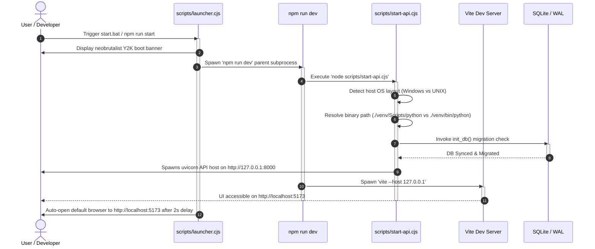

# 🚀 Setup, Launch, & Package Blueprints

This guide covers the system requirements, installation workflows, automatic launcher mechanics, standalone desktop compiling, and comprehensive troubleshooting protocols for **Darf UI**.

---

## 📋 Prerequisite Grid

Ensure your local development machine matches these environmental guidelines before initializing the launch sequence:

| Dependency | Minimum Version | Target Version | Purpose |
| :--- | :--- | :--- | :--- |
| **Node.js** | v18.0.0 | v20.11.0 (LTS) | Powers the Vite dev server, launcher subprocesses, and packaging. |
| **Python** | v3.10.0 | v3.11.9 (Recommended) | Backend server stack, database ORM engine, and LanceDB Arrow queries. |
| **Ollama** *(Local Host)* | v0.1.30 | v0.1.48+ | Extremely simple local model engine with zero setup. |
| **Kobold.cpp** *(Highly Rec)* | v1.50 | v1.68+ | Recommended for physical laptop optimization (ContextShift & KV cache compression). |

---

## 🛠️ Step-by-Step Installation

Darf UI offers both a fully automated **one-click installer package** and a modular **manual terminal layout** to fit your workflow.

### 🔷 Option A: One-Click Automated Installers (Recommended)

The workspace includes preconfigured OS shell scripts that automatically verify dependencies, construct a localized Python virtual environment (`venv`), compile local dependencies, and synchronize node packages in a single step.

1. Extract the Darf UI workspace into a dedicated folder.
2. Trigger the specific setup shortcut for your operating system:

| OS | Desktop Action | CLI Execution | Launch Shortcut |
| :--- | :--- | :--- | :--- |
| **Windows** | Double-click **`install.bat`** | `.\install.bat` | **`start.bat`** |
| **macOS** | Double-click **`install.command`** | `chmod +x install.command && ./install.command` | **`start.command`** |
| **Linux** | Run standard shell script | `chmod +x install.sh && ./install.sh` | **`start.sh`** |

---

### 🔷 Option B: Manual Terminal Execution

For developers seeking direct console logging during environment configuration:

#### Step 1: Initialize Python Virtual Environment
Open a terminal in the root workspace folder and build the Python virtual sandbox:
```bash
python -m venv venv
```
> [!IMPORTANT]
> **Do not activate the virtual environment manually.** The Darf UI launcher script automatically detects the virtual environment folder in your root directory and resolves the correct absolute python binary path on all platforms.

#### Step 2: Compile Python Dependencies
Install required packages into your virtual environment:
```bash
# On Windows platforms:
venv\Scripts\pip install -r requirements.txt

# On macOS / Linux platforms:
venv/bin/pip install -r requirements.txt
```

#### Step 3: Synchronize Node Modules
Install frontend UI packages:
```bash
npm install
```

---

## ⚡ Subprocess Launcher Sequence

Darf UI utilizes a smart launcher orchestrator (`scripts/launcher.cjs`) to concurrently launch and clean up the backend FastAPI server and the frontend Vite web server under a unified parent process.



---

## 📦 Standalone Native Desktop Packaging

For end-user distributions, Darf UI packages cleanly into a **fully standalone Windows Desktop Application installer (`.exe`)** with an absolute installation wizard.

### The Desktop Build Pipeline:
1. Open an Administrator PowerShell terminal in the root workspace folder.
2. Trigger the PowerShell packaging orchestrator:
   ```powershell
   powershell -ExecutionPolicy Bypass -File scripts/build-desktop.ps1
   ```
3. **Under the Hood mechanics**:
   - Compiles Vite React assets into statically optimized HTML/CSS structures (`dist/`).
   - Invokes `PyInstaller` to bundle the FastAPI backend, Uvicorn service, and all virtual environment libraries into a consolidated, native executable.
   - Compiles Inno Setup scripts to pack everything into a high-fidelity Windows installer wizard written directly to `dist\DarfUI-Setup.exe`.

### The Desktop Runtime Shell:
- Once installed via `DarfUI-Setup.exe`, the application launches directly inside a **custom native Edge WebView2 frame shell** (via PyWebView).
- Operates serverless and borderless, running local database routines in the background and eliminating standard browser navigation bars for a fully premium, immersive roleplay sandbox.

---

## 🔧 Troubleshooting & Port Resolutions

### 1. "venv/Scripts/python" Spawn Failure
* **Root Cause**: The Python virtual environment was created outside the root directory, or the python installation failed to link.
* **Resolution**: Delete any corrupt `venv` directories in your root and rebuild cleanly:
  ```bash
  rmdir /s /q venv  # (Windows Command Prompt)
  python -m venv venv
  venv\Scripts\pip install -r requirements.txt
  ```

### 2. Local LLM Connection Refused (CORS Blocking)
* **Root Cause**: The local LLM backend (Ollama or Kobold.cpp) is running but blocking cross-origin HTTP calls from `localhost:5173`.
* **Resolution for Ollama**: Stop Ollama from your taskbar/systray and relaunch it in a console session with global origins unlocked:
  * **Windows (PowerShell)**: `$env:OLLAMA_ORIGINS="*" ; ollama serve`
  * **macOS / Linux**: `OLLAMA_ORIGINS="*" ollama serve`
* **Resolution for Kobold.cpp**: Ensure you tick the **`CORS`** flag in the GUI loader, or launch via console appending the command-line argument:
  ```bash
  koboldcpp.exe --cors
  ```

### 3. Port 8000 (FastAPI) or 5173 (Vite) Collision
* **Root Cause**: A previous uvicorn session crashed or remains locked in the background, blocking the network ports.
* **Resolution**: Kill the active background tasks locking the TCP ports:
  * **Windows (PowerShell)**:
    ```powershell
    Get-NetTCPConnection -LocalPort 8000 | ForEach-Object { Stop-Process -Id $_.OwningProcess -Force }
    ```
  * **macOS / Linux**:
    ```bash
    kill -9 $(lsof -t -i:8000)
    ```

### 4. SQLite "database is locked" (WAL File locks)
* **Root Cause**: Multiple background Python processes are concurrent-writing to `darf.db` without WAL concurrency resolved.
* **Resolution**: Press `Ctrl+C` in all active terminal sheets. If a lock persists, navigate to the `data/` folder and manually delete `darf.db-shm` and `darf.db-wal` (these are temporary write-ahead log files; deleting them is completely safe). Relaunch `start.bat`.
